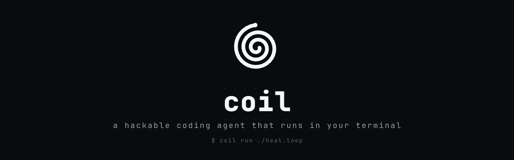

<p align="center">
  
</p>

<p align="center">
  <a href="#license"></a>
  
  
  
  <a href="#contributing"></a>
</p>

<p align="center">
  <b>A hackable coding agent that runs in your terminal.</b><br/>
  Read, write, search, and run — with streaming, tools, and persistent chats. Built from scratch, small enough to read in an afternoon.
</p>

---

## Why coil

Most coding agents are black boxes. `coil` is the opposite: a complete agent loop you can actually read and modify. The entire core — the loop, the tool registry, the LLM client — is a few hundred lines of TypeScript with no framework magic.

It runs against **any OpenAI-compatible API** (Ollama, OpenRouter, or your own), keeps your chats in a local SQLite database, and ships a clean terminal UI.

The north star: a runtime for **verified, self-correcting agent loops** — loops that don't stop until an objective check passes. This direction is grounded in the LLM-verifiability research; see [the plan](#the-plan-grounded-in-research) and the [roadmap](#roadmap).

## Features

- **Streaming TUI** — token-by-token responses in a clean Ink interface, with an animated coil spinner.
- **Real tools** — read/write files, list directories, grep and glob the codebase, run shell commands, and search the web.
- **Persistent sessions** — every chat is saved to local SQLite; resume any past conversation.
- **Resilient** — automatic retries with backoff on transient LLM failures; tool errors are fed back to the model to self-correct instead of crashing.
- **Model-agnostic** — point it at Ollama, OpenRouter, or any OpenAI-compatible endpoint.
- **Zero-config persistence** — no database server to run; storage is an embedded file.

## Quickstart

```sh
# 1. install
git clone https://github.com/ayush18pop/coil
cd coil
bun install

# 2. configure — create a .env
cat > .env <<'EOF'
LLM_BASE_URL=http://localhost:11434     # Ollama default
LLM_API_KEY=ollama
LLM_MODEL=qwen2.5-coder:7b
TAVILY_API_KEY=                          # optional, for web_search
EOF

# 3. run the TUI
bun src/tui/index.tsx
```

Using OpenRouter instead of local Ollama:

```env
LLM_BASE_URL=https://openrouter.ai/api
LLM_API_KEY=sk-or-...
LLM_MODEL=anthropic/claude-sonnet-4-5
```

## Tools

| Tool             | Description                                     |
| ---------------- | ----------------------------------------------- |
| `read_file`      | Read the contents of a file                     |
| `write_file`     | Write or overwrite a file                       |
| `list_directory` | List files and folders in a directory           |
| `grep_search`    | Search file contents for a regex (ripgrep/grep) |
| `find_files`     | Find files by glob pattern                      |
| `run_command`    | Run a shell command                             |
| `web_search`     | Search the web (Tavily)                         |

Adding a tool is two steps — create the file and register it. The loop picks it up automatically:

```ts
import { registerTool } from "../registry";

registerTool(
  "my_tool",
  {
    type: "function",
    function: {
      name: "my_tool",
      description: "...",
      parameters: {
        /* ... */
      },
    },
  },
  async (args: { input: string }) => "result",
);
```

## TUI commands

| Command        | Action             |
| -------------- | ------------------ |
| `/new`         | Start a fresh chat |
| `/list`        | List saved chats   |
| `/resume <id>` | Resume a past chat |
| `/help`        | Show commands      |

## Architecture

```
src/
  agent/
    agent-loop.ts     # the core loop: call LLM, run tools, repeat until done
    system-prompt.ts  # agent instructions
  llm/
    llm.ts            # streaming OpenAI-compatible client + retry/backoff
  tools/
    registry.ts       # tool registration + dispatch
    file-system/      # read, write, list
    search/           # grep, find
    shell/            # run_command
    web/              # web_search
  session/
    session.ts        # SQLite session store (.coil/coil.db)
  tui/
    app.tsx           # chat UI: transcript, streaming, commands
    spinner.tsx       # animated terminal spinners
  types/              # Message + ToolCall types
```

The loop is intentionally tiny: call the model with the conversation and tool schemas, execute any tool calls it returns, append the results, and repeat until it answers with plain text.

## The plan, grounded in research

`coil`'s direction isn't a hunch — it follows what the research on **LLM verifiability** actually shows.

An LLM's raw output can't be trusted by default. There are three ways to fix that, and good systems layer all three:

| Lever       | What it means                                                          | What coil does with it                                                                     |
| ----------- | ---------------------------------------------------------------------- | ------------------------------------------------------------------------------------------ |
| **Prevent** | Make invalid output impossible while generating (constrained decoding) | Constrain tool-call JSON so it's valid by construction — fewer malformed calls, no retries |
| **Detect**  | Check output with a _separate_, objective judge                        | The `verify` step: an objective command (`exit 0`), never the model grading itself         |
| **Correct** | Loop on real feedback to fix mistakes                                  | The agent loop feeds tool/execution errors back so the model self-corrects                 |

The single thread across every paper: **trust an external, objective signal over the generator's own opinion.** That's the entire reason for `coil`'s north star — _no verify, no run_. Concretely, the research shapes the roadmap like this:

- **`verify` must be an objective command, not an LLM self-judgment.** Self-correction without an external signal is unreliable and can make things _worse_ ([When Can LLMs Correct Their Own Mistakes?](https://arxiv.org/abs/2406.01297)). A separate checker — ideally provable ([BEAVER](https://arxiv.org/abs/2512.05439)), at minimum a real test/judge ([Let's Verify Step by Step](https://arxiv.org/abs/2305.20050)) — beats trusting the model.
- **Execution is the practical verifier.** Running the code is the feedback that makes a fix-loop actually work ([Revisit Self-Debugging](https://arxiv.org/abs/2501.12793)) — the basis for the planned `heal.loop`.
- **Don't certify success by sampling.** "I tried it and it looked fine" misses the rare, costly failures; an objective check catches them ([BEAVER](https://arxiv.org/abs/2512.05439)).
- **Constrain structured output.** Tool calls should be valid by construction, and it can be done with no quality or speed cost ([GCD](https://arxiv.org/abs/2305.13971), [DOMINO](https://arxiv.org/abs/2403.06988)).

## Roadmap

**Now**

- [x] Streaming agent loop with tool calling
- [x] File / search / shell / web tools
- [x] Persistent SQLite sessions
- [x] Terminal UI with live streaming
- [x] Retries and graceful tool-error recovery

**Next**

- [ ] `edit_file` — surgical find-and-replace instead of whole-file rewrites
- [ ] `web_fetch` — open and read a page from search results
- [ ] Session picker on startup
- [ ] Scrolling transcript for long chats
- [ ] Per-tool spinners and status

**North star — verified loops**

- [ ] `Loopfile` spec — declare a goal, an objective `verify` command, and a budget
- [ ] `coil run ./task.loop` — drive the agent until the verifier passes, then stop
- [ ] Budgets and graceful failure (`no verify, no run`)
- [ ] Pluggable backends and loop composition

## Contributing

Contributions are welcome. The codebase is deliberately small and readable — a good place to learn how coding agents actually work. Open an issue to discuss larger changes, or send a PR for fixes and new tools.

## License

[MIT](LICENSE)
